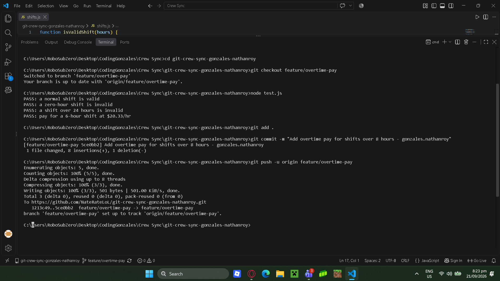
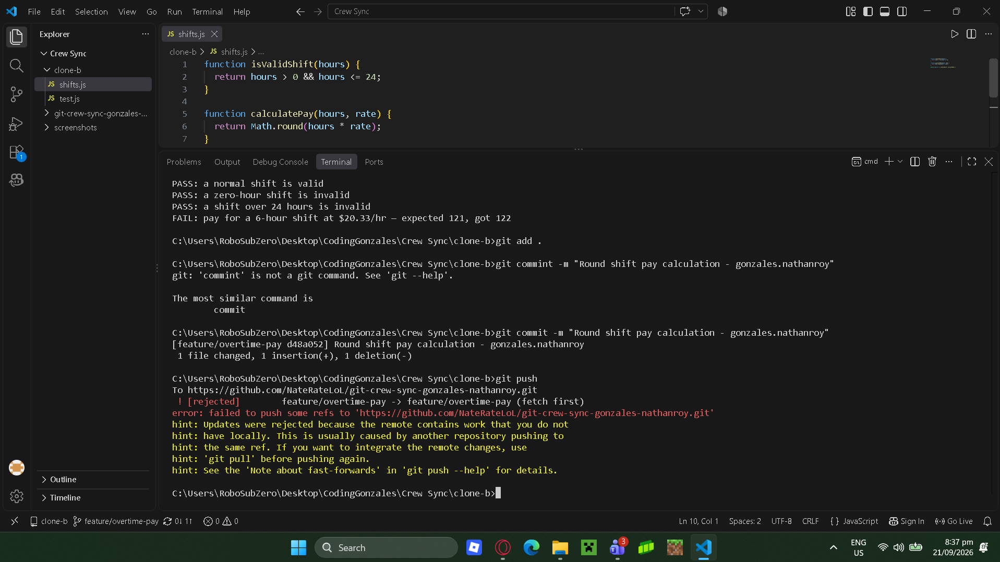
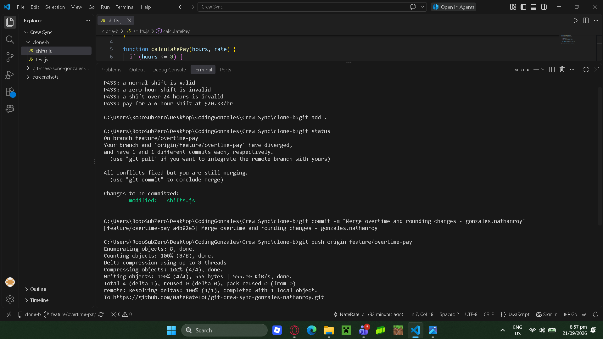
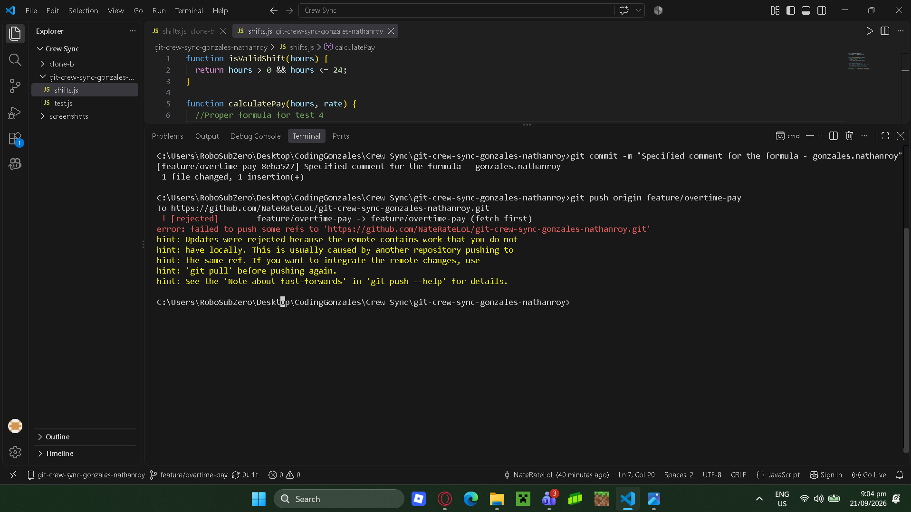
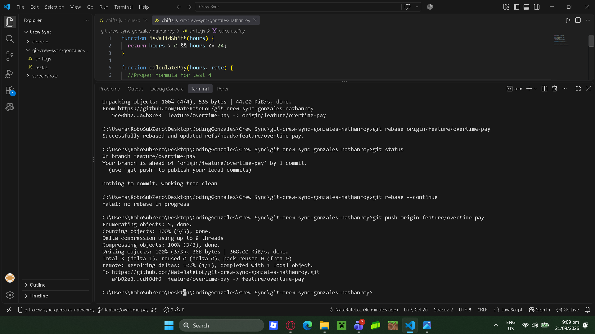
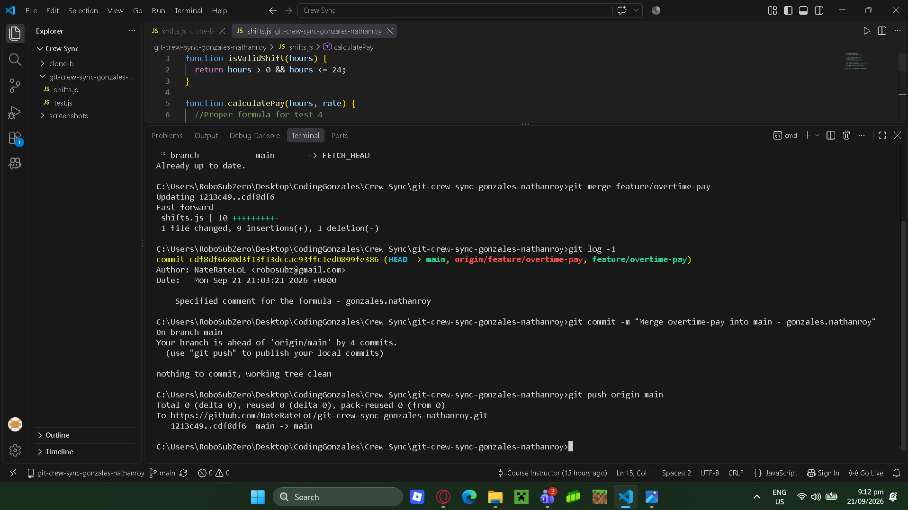

1. The push was rejected because the remote work contains work that I do not have locally, pushing without pulling means the latest commit will be ignored.

2. In task 3, merge was used to combine the changes from the remote files and my local files. This created a merge commit and kept both of the lines in the commit

In task 4, rebeased was use to move my local commit on top of the updated remote commit.

3. A good habit is to always fetch or pull the latest changes because you dont know what has been updated in the team's project. This helps to make sure that my local files is up to date with my team's work.

4. I would default to merge on a shared team branch because it keeps th existing commit history and won't rewrite commits that other team members have made.

## Task 1 Screenshot

## Task 2 Screenshot

## Task 3 Screenshot

## Task 4 Screenshot

## Task 5 Screenshot
